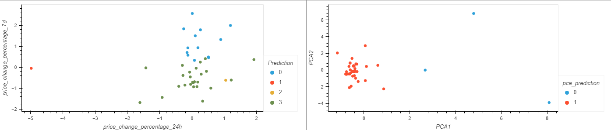

# CryptoClustering
Module 19 Challenge
In this challenege, we were asked to predict if crytocurrencies are affected by 24-hour or 7-day price changes.

# Steps
Create new repository
Load and pre process data
Use StandardScaler to normalize the data
Find the Best Value for k Using the Original Scaled DataFrame
Cluster Cryptocurrencies with K-means Using the Original Scaled Data
Optimise Clusters with Principal Component Analysis
Find the Best Value for k Using the PCA Data
Cluster Cryptocurrencies with K-means Using the PCA Data

# Analysis

It seems that reducing the number of features used in K-Means has had an impact.In the original data the optimal value for K was 4 and had four clusters. Using PCA, the optimal value remained the same but the clusters reduced to 2

# Resources
Pandas
hvplot
sklearn